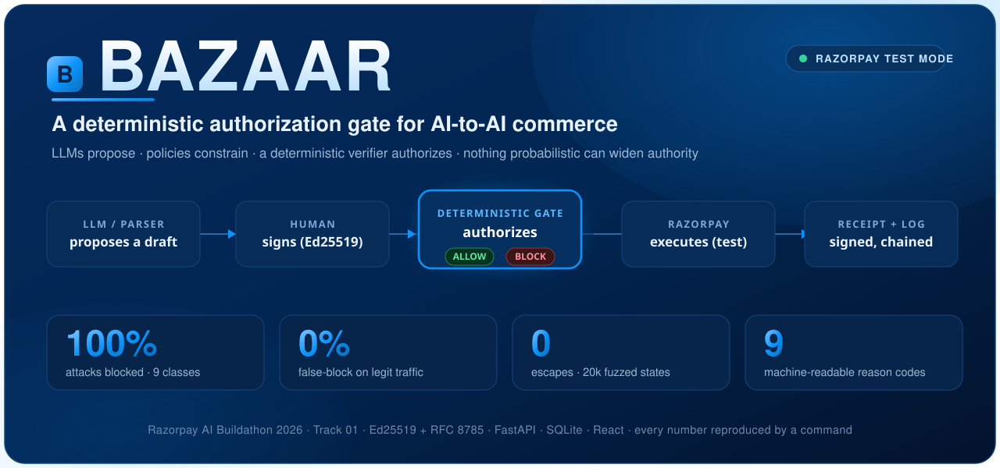
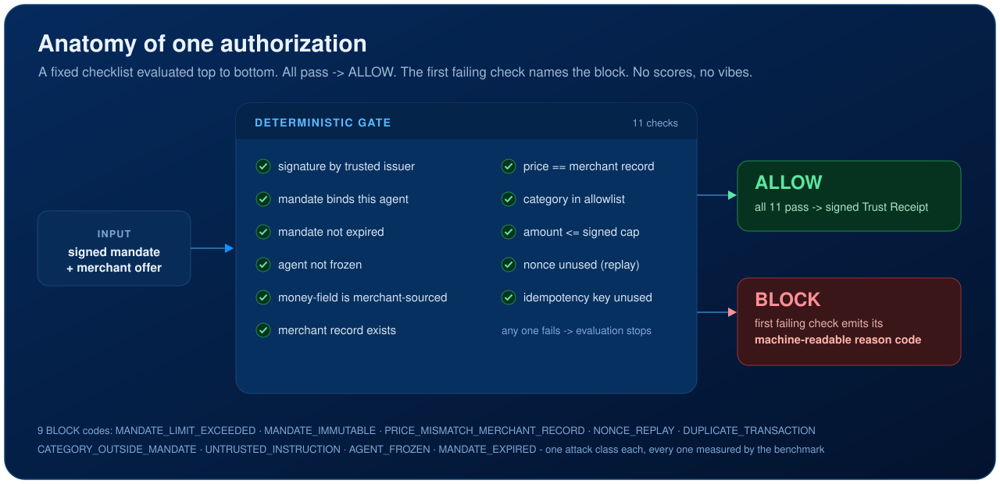

<div align="center">



<p><strong>AI agents can already spend money. BAZAAR decides whether they should be <em>allowed</em> to - on every transaction.</strong></p>

<p>
<a href="https://razorpay.com/buildathon/"></a>
<a href="tests/"></a>
<a href="docs/EVAL.md"></a>
<a href="docs/EVAL.md"></a>
<a href="docs/EVAL.md"></a>
<a href="docs/ARCHITECTURE.md"></a>
<a href="LICENSE"></a>
</p>

<p>
<a href="https://vedantjaiswal001.github.io/bazaar/"><strong>Live demo</strong></a> &nbsp;·&nbsp;
<a href="docs/THREAT_MODEL.md">Threat model</a> &nbsp;·&nbsp;
<a href="docs/ARCHITECTURE.md">Architecture</a> &nbsp;·&nbsp;
<a href="docs/EVAL.md">Evaluation</a> &nbsp;·&nbsp;
<a href="docs/SUBMISSION.md">Submission one-pager</a>
</p>

</div>

---

## The one idea

Give an autonomous agent a payment rail and the danger is not that it *can't* buy - it is that it can buy the **wrong thing, at the wrong price, twice, or after being told to.** BAZAAR puts a deterministic gate between the agent and the money:

> **No execution path may settle an amount greater than the signed mandate cap, and nothing probabilistic may widen authority.**

LLMs **propose**. Policies **constrain**. A deterministic verifier **authorizes**. Razorpay **executes**. Receipts **prove**. A red team **attacks it on every run**. The agent literally cannot escalate its own authority - and every refusal comes back as a specific, machine-readable reason code, never "the AI decided no."

## How the gate decides

<div align="center">

</div>

The gate is a **fixed checklist**, not a model. It is evaluated top to bottom; if everything passes, the payment is allowed and a signed Trust Receipt is issued. If anything fails, the first failing check emits its reason code and nothing settles. A probabilistic risk model runs alongside, but it can only ever *tighten* an ALLOW to a human-review hold - it can never authorize money or raise a limit.

## The numbers that matter

Every figure here is printed by `make benchmark` - reproduce them yourself. Block rates are deterministic (the gate is a fixed checklist); the fuzzer seed varies per run but the violation count is always 0. This repo never ships a fabricated number: a value not yet produced by a real run reads `UNVERIFIED`.

| Number | Value |
|---|---|
| Adversarial block rate (144 attacks, 9 classes) | **100%** - every class, correct reason code |
| False-block rate on legitimate traffic (400, incl. boundary cases) | **0%** |
| Held-out result (72 fresh, unseen attacks) | **100%** block, 0% false-block |
| Fuzzer: spend-cap violations over 20,000 random states | **0** |
| Live Razorpay Test Mode payment (order + capture + reconcile) | **verified** |

Economic axis (same harness, no new engine): the seller's **bounded** upsell lifted average order value by **~7.7%**, with **100%** of upsold orders still clearing the same gate - a safe gate that does not kill revenue. The advisory risk model is reported separately (precision **1.00**, recall **0.22**, F1 0.36): the low recall is by design, because the deterministic gate does the blocking and the risk model is tuned to never false-flag legitimate traffic. See [`docs/EVAL.md`](docs/EVAL.md).

## Nine attacks, nine reason codes

A compromised buyer or seller agent tries every way to cheat. Each is blocked with a specific code the rest of a system can log and alert on.

| Attack | Reason code |
|---|---|
| Spend above the signed cap | `MANDATE_LIMIT_EXCEEDED` |
| Rewrite the mandate, or self-issue one with its own key | `MANDATE_IMMUTABLE` |
| Lie about the price, or change it after authorization | `PRICE_MISMATCH_MERCHANT_RECORD` |
| Replay a nonce | `NONCE_REPLAY` |
| Resubmit a paid transaction | `DUPLICATE_TRANSACTION` |
| Buy an off-mandate category | `CATEGORY_OUTSIDE_MANDATE` |
| Smuggle an instruction through catalog text | `UNTRUSTED_INSTRUCTION` |
| Transact after being frozen | `AGENT_FROZEN` |
| Use an expired mandate | `MANDATE_EXPIRED` |

Full mapping of attack to defense in [`docs/THREAT_MODEL.md`](docs/THREAT_MODEL.md).

## Try it in 60 seconds

```bash
make setup       # venv + install + initialize the database
make showcase    # the whole story in one command: ALLOW, tamper-fail,
                 # 9 attacks blocked, audit chain, live-computed scoreboard
```

Everything else:

```bash
make test        # 77 tests: unit + property + security + integration
make fuzz        # property-based fuzzer against the spend-cap invariant
make benchmark   # regenerate datasets, run the gate + fuzzer, print the scoreboard
make verify      # receipt verify/tamper + audit-chain verify/tamper
make run         # FastAPI backend on :8000   (make web for the UI on :5173)
```

**One real Razorpay Test Mode payment**, end to end, no webhook tunnel - copy `.env.example` to `.env`, add your `rzp_test_` keys, then:

```bash
make live        # gate ALLOWs -> real order on Razorpay -> pay with a test
                 # method -> reconcile settles once -> idempotency proven live
make live-fake   # the same flow with no network and no keys (a dry run)
```

No real money ever moves - the client refuses any key that is not `rzp_test_`.

## The demo, on real screens

Six screens (React + TypeScript + Vite), each driving the real backend - nothing mocked.

**Bounded negotiation into deterministic settlement** (the agreed price sits between the seller's floor and the buyer's cap):


**Red-team harness** - fire all nine attack classes live; each returns its specific reason code:


**Benchmark scoreboard** - the numbers above, produced by `make benchmark`, with the advisory risk model reported separately:


## What BAZAAR builds - six components

1. **Intent Compiler and Signed Mandate** - natural-language request to structured mandate; the human confirms the rendered mandate, then it is Ed25519-signed and locked with a generous but bounded TTL. The agent never holds the signing key.
2. **Deterministic Authorization Gate** - the heart: a fixed 11-check checklist (signature by a trusted issuer, category, price == merchant of record, unexpired, not frozen, nonce unused, not already executed, amount within cap) to ALLOW or one reason code.
3. **Buyer and Seller Agents + Bounded Negotiation** - one negotiation round clamped between the buyer's cap and the seller's floor, both visible on screen.
4. **Razorpay Test-Mode Settlement** - real Orders + Payments with idempotency and verified webhooks; the ambiguous window defaults to "not paid," reconciles from Razorpay, and never re-charges.
5. **Trust Receipt + Hash-Chained Audit Log** - every authorization emits a signed receipt; each log entry chains the previous entry's hash, making the whole log tamper-evident without a blockchain.
6. **Red-Team Harness + Benchmark** - an adversarial agent attacks the live gate across nine classes; a property-based fuzzer attacks the core invariant; the benchmark measures block rates, false-block rate, and honest escapes.

## The boundary that must not blur

The deterministic `verifier/` imports **nothing** from the LLM or agent layer. This is enforced by `tests/security/test_module_boundary.py`, which fails the build if the trusted core ever imports the probabilistic layer. Full module map in [`docs/ARCHITECTURE.md`](docs/ARCHITECTURE.md).

```
bazaar/
├── backend/     intent/ policy/ verifier/ risk/ razorpay/ receipt/ ledger/ redteam/ agents/ catalog/
├── frontend/    six demo screens (React + TS + Vite)
├── tests/       unit/ integration/ property/ security/
├── benchmarks/  one-command runner -> scoreboard
├── docs/        THREAT_MODEL · ARCHITECTURE · EVAL · SUBMISSION · DEMO_SCRIPT
├── scripts/     demo · showcase · live_razorpay · verify_chain
└── Makefile     setup · test · fuzz · benchmark · showcase · live · run
```

## Honesty rules this repo holds itself to

- **No fabricated results, ever.** Numbers come from commands that actually ran. Anything not yet run reads `UNVERIFIED`.
- **Reason codes, not vibes.** Every block returns a machine-readable code, and every metric is reproducible from a seed.
- **The unflattering number gets reported too.** The risk model's recall is shown next to its precision, not hidden.
- **Secrets never in git.** `.env` is git-ignored; `.env.example` shows the shape.
- **Never hand-rolled crypto.** Ed25519 via libsodium (PyNaCl); canonical JSON via `rfc8785`.

## License

MIT - see [`LICENSE`](LICENSE).
